# eisenberg.dev

[](https://github.com/seisenberg/eisenberg.dev/actions/workflows/test.yml)
[](https://github.com/seisenberg/eisenberg.dev/actions/workflows/codeql.yml)

The source of [eisenberg.dev](https://eisenberg.dev): a public portfolio page in front of a private
system I use every day. Internally it is called **eisenmail**.

- **Catch-all mail for several domains.** Every address at every domain is an inbox. Give each
  company, shop or newsletter its own address and see at a glance who leaked it.
- **A webmail client** laid out like macOS Mail on the desktop and iOS Mail on a phone, installable
  as a home-screen app with push notifications.
- **A reply relay.** Mail can be forwarded to a private mailbox, and replying from that mailbox
  reaches the sender *from the address they wrote to*. The private mailbox never shows.
- **A private file drop** with opt-in public links.

It runs on two container Lambdas and one small PostgreSQL, for a few dollars a month.

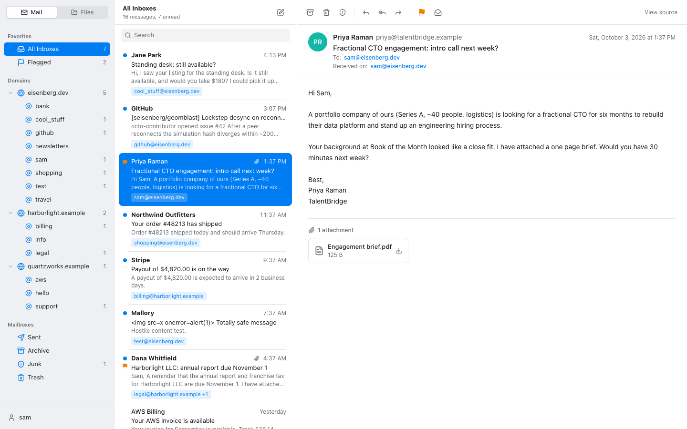

| | | |
| --- | --- | --- |
| 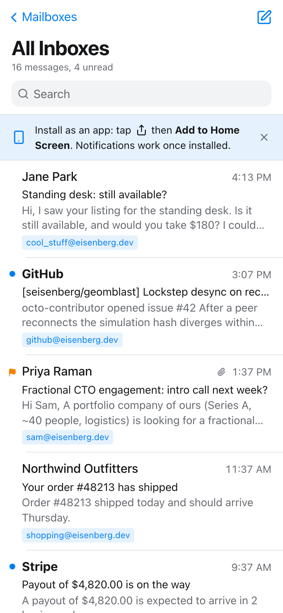 | 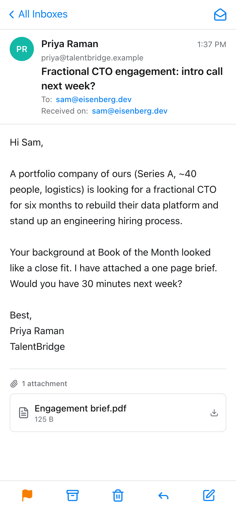 | 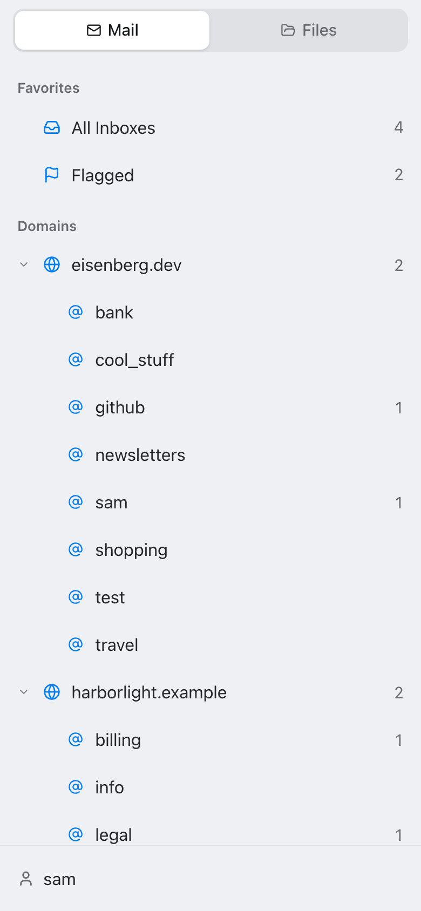 |

## How it fits together

```
                    ┌────────────── SES receiving (all domains, catch-all) ──────────────┐
 sender ──mail────▶ │ S3 raw object ─▶ inbox lambda (python, Dockerfile.python)          │
                    │   ├─ stores the raw mail in postgres                               │
                    │   ├─ per-address rules: forward? notify? inline or attached?       │
                    │   ├─ forwards from reply-<token>@domain to a private mailbox       │
                    │   ├─ relays replies back to the sender from the alias address      │
                    │   └─ web push to the installed app                                 │
                    └────────────────────────────────────────────────────────────────────┘
 browser ─https──▶ API Gateway ─▶ web lambda (node, Dockerfile.node, Lambda Web Adapter)
                      ├─ /            public portfolio
                      ├─ /mail        webmail (sign-in required)
                      ├─ /files       file drop (sign-in required)
                      └─ /public/<f>  files marked public
```

| Layer | Choices |
| --- | --- |
| Receiving | SES receipt rule, S3, Python 3.13 Lambda container |
| Web | Koa on the AWS Lambda Web Adapter, API Gateway HTTP API |
| UI | React 19, Tailwind 4, shadcn/ui on Radix, TanStack Query, no client-side state library |
| Data | PostgreSQL on a tiny EC2 instance, reached through an ssh tunnel that can only forward one port |
| Delivery | GitHub Actions with OIDC (no stored AWS keys), CloudFormation for the account |

## Features

### Mail

- **All Inboxes** across every domain, a folder per **domain**, and under each an inbox per
  **receiving address**. An address is listed only while it has mail in its inbox: delete or
  archive the last message and the folder goes away. Every row shows which address the mail
  arrived on.
- Replies default to the address that received the message. The From field accepts any address on
  any configured domain, with a menu of addresses seen so far.
- Flag, mark unread, archive, junk, trash, put back, permanent delete, search, multi-select,
  attachments, raw source. Full keyboard control on the desktop (`↑ ↓` `j k` `r` `a` `f` `e` `s`
  `u` `n` `/` `⌫` `⌘↩`).
- New mail appears within 30 seconds while the page is open.

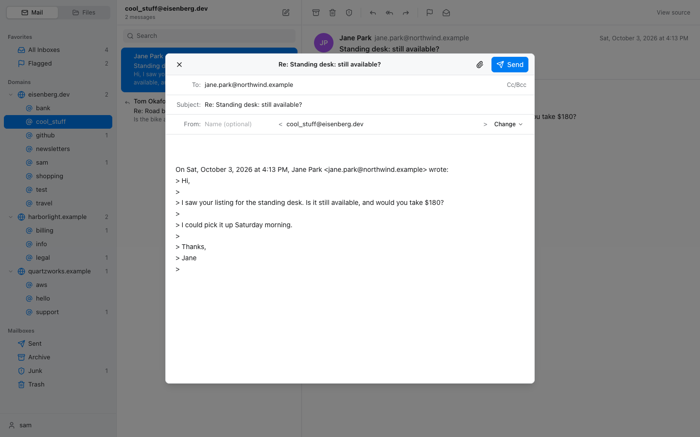

### Hostile mail stays harmless

Every byte of an inbound message belongs to the sender. HTML bodies are sanitised, rendered in a
sandboxed frame that cannot run script, and cut off from the network by a Content-Security-Policy
of their own. Remote images, the usual open-tracking pixel, stay blocked until asked for.

| | |
| --- | --- |
| 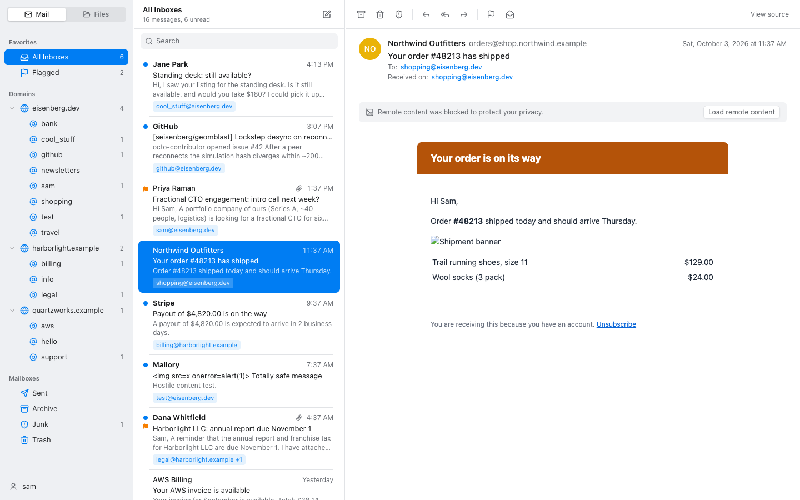 | 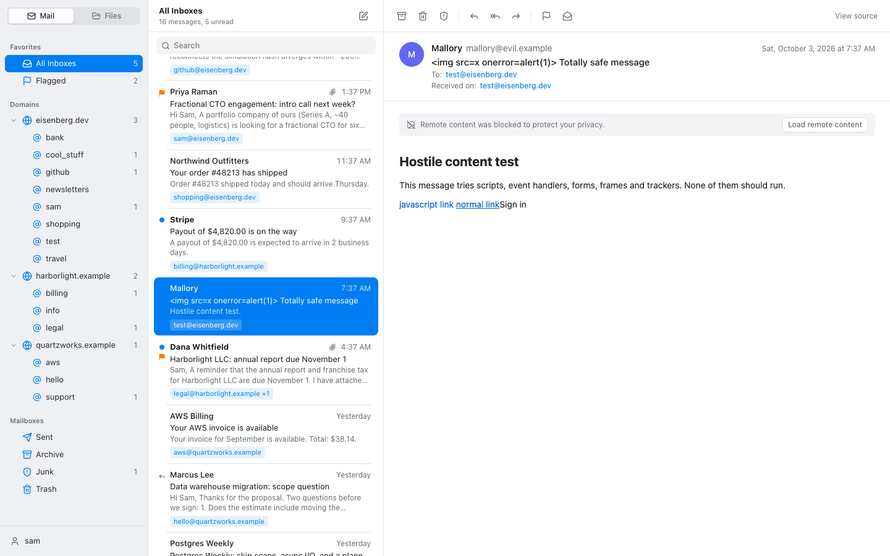 |

### Forwarding, notifications and the reply relay

Each receiving address has its own rule: forward a copy to the private mailbox or not, send a push
notification or not, and forward the original inline or as an attachment. A default covers
addresses that have never received mail. Mail is always stored and shown in the webmail, so the
installed app with notifications can replace forwarding altogether.

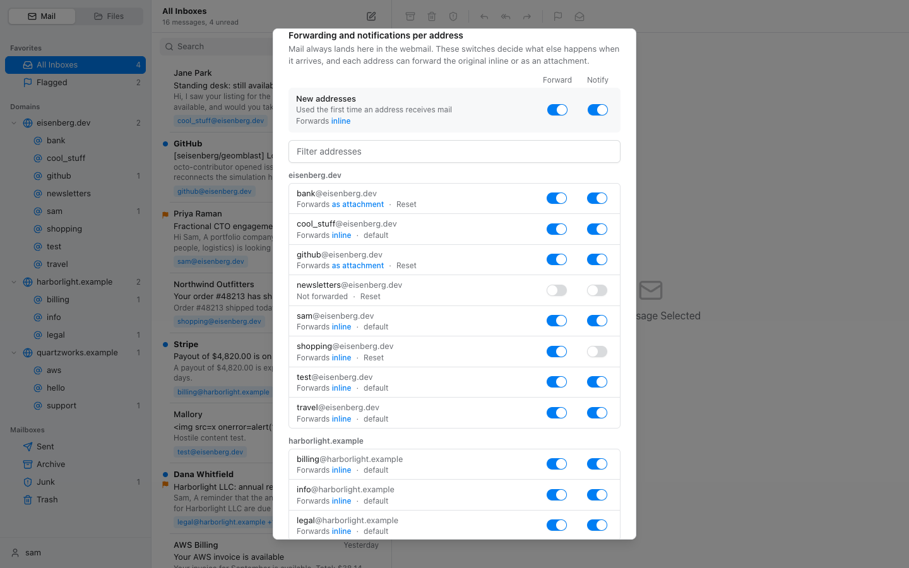

The relay works like the one classified-ad sites use:

1. Mail for `cool_stuff@eisenberg.dev` arrives. If that address forwards, the private mailbox
   receives it from `"Jane Park via cool_stuff@eisenberg.dev" <reply-<token>@eisenberg.dev>`.
2. A reply from the private mailbox comes back to the catch-all. It is relayed only if the token
   exists, the sender is the owner, SES reports DMARC `PASS` for it, and it is not an auto-reply.
3. The reply is rebuilt from the body alone. Every header from the owner's mail client is dropped,
   the private address and the relay address are scrubbed from quoted text in every encoding, and
   a final check refuses to send if either still appears anywhere in the message.
4. Jane receives an ordinary reply from `cool_stuff@eisenberg.dev`, correctly threaded.

### On a phone

Below 768px the webmail becomes one screen at a time (Mailboxes, list, message) with the system
back gesture working between them. Swipe a row left to delete and right to toggle read. Wide HTML
mail is scaled to fit. The site is an installable web app: unread badge on the icon, push
notifications, 30-day sliding sign-in. The service worker handles notifications only and caches
nothing, so mail never sits in a browser cache.

| | | |
| --- | --- | --- |
| 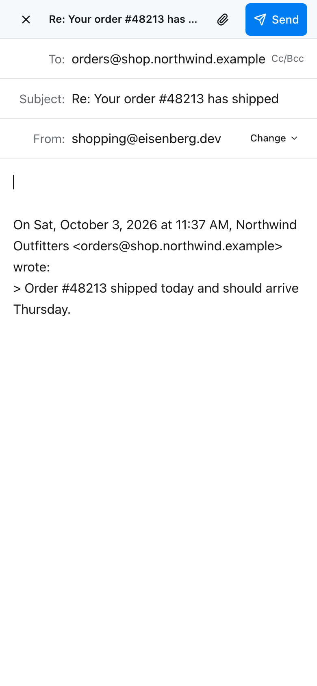 | 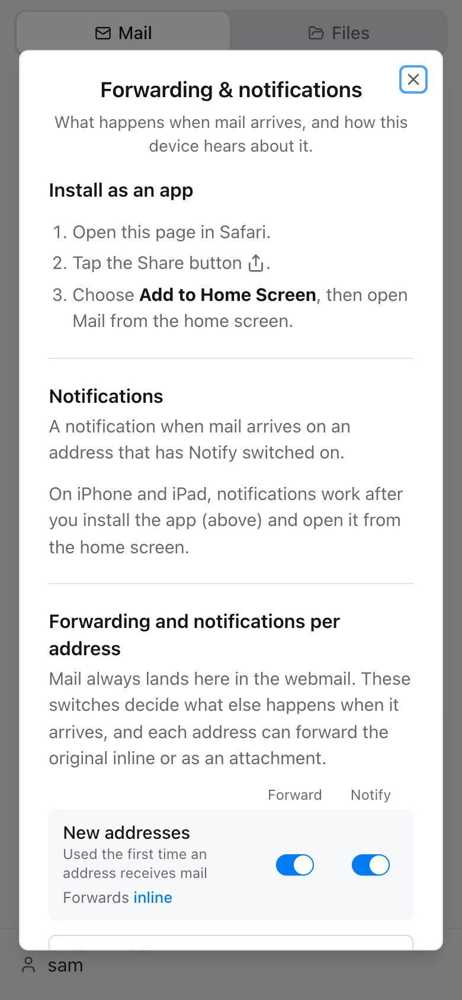 | 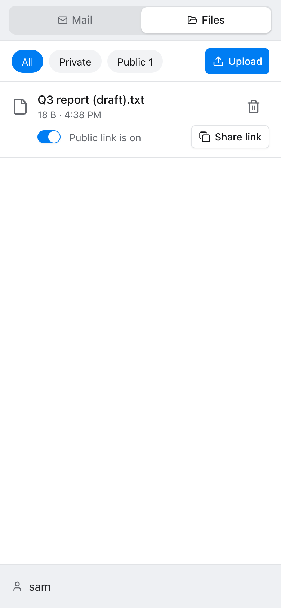 |

To install: open `/mail` in Safari (Share, **Add to Home Screen**) or Chrome (**Install**), open
it from the home screen, then account menu, **Forwarding & notifications**, **Turn on
notifications**. On iPhone, notifications only work from the installed app (iOS 16.4 or later).

### File drop

Upload, download and delete files in S3 from the browser. Everything is private. Switching on
"Public link" moves the file to a separate location and gives it a `/public/<name>` address.
Neither bucket is publicly readable; downloads are short-lived signed links.

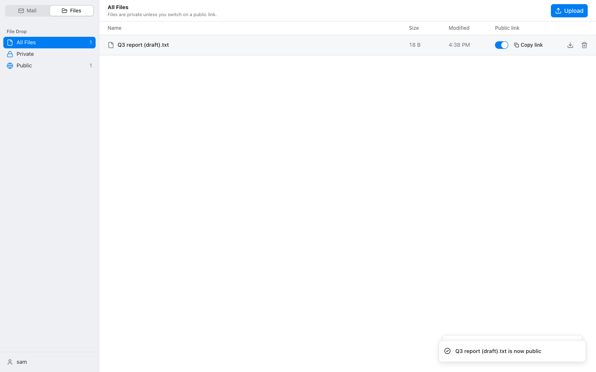

### Dark mode

Follows the system.

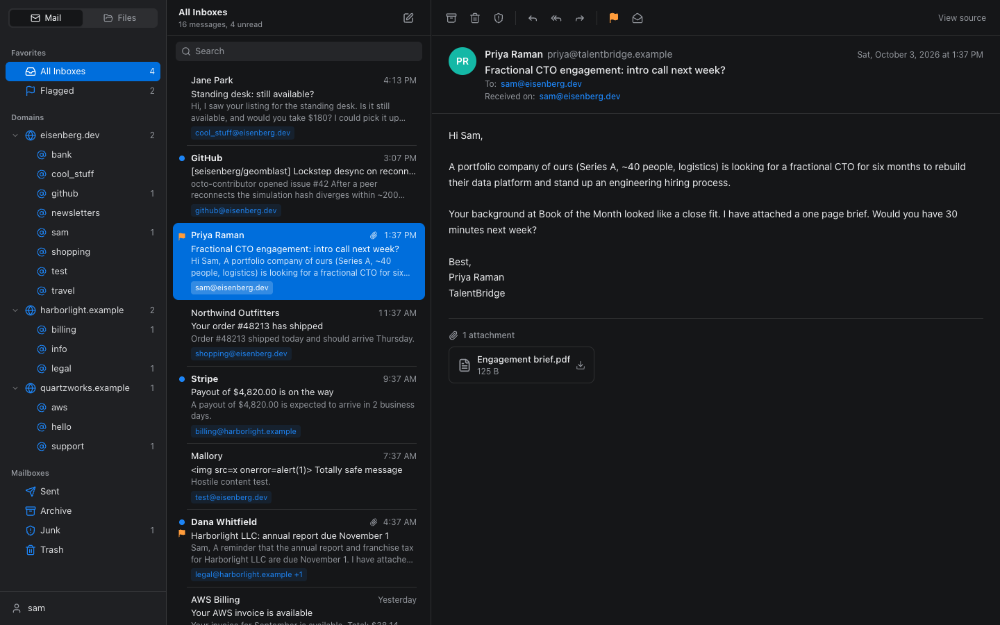

## Security

Read [SECURITY.md](SECURITY.md) for the design and the findings of an independent review. In short:

- scrypt password hashes, optional TOTP, revocable server-side sessions in `HttpOnly`, `Secure`,
  `SameSite=Strict`, `__Host-` cookies, three-layer CSRF defence, login throttling that an attacker
  cannot turn into a lockout;
- strict Content-Security-Policy, no third-party scripts, no CORS;
- parameterised SQL throughout, hostile input cleaned before it reaches the database;
- no secrets in the repository or in container images: they are read from SSM at runtime;
- least-privilege IAM for both functions and for deployment.

Found a problem? See the reporting section of [SECURITY.md](SECURITY.md).

## Run it locally

Needs Node 22 or later. No Docker, no AWS account, no system PostgreSQL.

```bash
npm install
npm run dev
```

Open http://localhost:8080. This starts a throwaway PostgreSQL (the `embedded-postgres` package,
data in `.data/`), applies `db/schema.sql`, seeds mock mail for three domains, logs outgoing mail
instead of sending it, and keeps the file drop on disk. The sign-in for local development is the
`DEV_USER` constant in [scripts/seed.ts](scripts/seed.ts).

```bash
npm test            # API integration tests against a real PostgreSQL
npm run typecheck
npm run build       # dist/ (UI) and build/ (server)
cd py && uv venv .venv && uv pip install -r requirements-dev.txt && .venv/bin/python -m pytest -q
```

## Deploying

[docs/SETUP.md](docs/SETUP.md) lists every step for a new AWS account: repository settings, two
CloudFormation stacks, the database host, secrets, SES and DNS, the custom domain, and a checklist
to confirm it works. After that, merging to `main` deploys.

| Workflow | When | What |
| --- | --- | --- |
| [Tests](.github/workflows/test.yml) | pull requests, `main` | typecheck, API tests, Python tests, both image builds, template lint |
| [Deploy](.github/workflows/deploy.yml) | `main` | tests, then build, push, update both functions through OIDC |
| [CodeQL](.github/workflows/codeql.yml) | pull requests, `main`, weekly | static analysis of TypeScript, Python and the workflows |
| [Dependency review](.github/workflows/dependency-review.yml) | pull requests | blocks newly added vulnerable dependencies |
| [Dependabot](.github/dependabot.yml) | weekly | npm, pip, base images, pinned actions |

## Layout

| Path | What |
| --- | --- |
| `py/` | inbox lambda: `inbox.py` (handler), `relay.py` (message rewriting), `push.py`, `db.py`, `config.py`, `tests/` |
| `src/server/` | web lambda: `app.ts` (routes, headers), `auth.ts`, `mail.ts`, `ingest.ts`, `send.ts`, `rules.ts`, `push.ts`, `files.ts`, `db.ts` |
| `src/ui/` | `pages/` (portfolio, sign-in), `mail/`, `files/`, `settings/`, `components/ui/` (shadcn) |
| `src/shared/api.ts` | types shared by server and UI |
| `public/` | web app manifest, icons, `sw.js` |
| `db/schema.sql` | the whole schema, idempotent |
| `infra/` | `bootstrap.yml`, `app.yml` (CloudFormation), `db-host.sh` |
| `scripts/` | `dev.ts`, `seed.ts`, `set-user.ts`, `apply-schema.ts`, `push-keys.ts` |
| `test/` | API integration tests |

## Data model

`lambda_inbox` is the raw store: one row per message with the verbatim MIME, written by whichever
side handled it (`inbound`, `junk`, `relay_out`, `sent`). The web lambda indexes new rows into
`messages` (sender, subject, our addresses and domains, mailbox, flags) when the webmail is open.
`relay_tokens` maps each forward's reply address to its conversation. `address_rules` and
`mail_settings` hold the per-address switches. `push_subscriptions` holds the devices to notify.

## Limits worth knowing

- Lambda responses are capped at 6 MB, so larger attachments cannot be downloaded through the
  webmail yet.
- The relay replies to the original sender only (no reply-all), and does not rewrite a name,
  signature or the metadata inside attached files.
- No offline mode: the installed app needs a connection.
