# eisenberg.dev

[](https://github.com/seisenberg/eisenberg.dev/actions/workflows/test.yml)
[](https://github.com/seisenberg/eisenberg.dev/actions/workflows/codeql.yml)

The source of [eisenberg.dev](https://eisenberg.dev): a public portfolio page in front of a private
system I use every day. Internally it is called **eisenmail**.

- **Catch-all mail for several domains.** Every address at every domain is an inbox. Give each
  company, shop or newsletter its own address and see at a glance who leaked it.
- **A webmail client** laid out like macOS Mail on the desktop and iOS Mail on a phone, installable
  as a home-screen app with push notifications.
- **A reply relay.** Mail can be forwarded to a private mailbox, and replying from that mailbox
  reaches the sender *from the address they wrote to*. The private mailbox never shows.
- **A private file drop** with opt-in public links.

- **An alias manager.** Note who each address was given to, see what it receives, and block it the
  day it starts getting spam.

It runs on two container Lambdas and one small PostgreSQL, for a few dollars a month, with nightly
backups that can be restored anywhere.


| | | |
| --- | --- | --- |
|  |  |  |

## How it fits together

```
                    ┌────────────── SES receiving (all domains, catch-all) ──────────────┐
 sender ──mail────▶ │ S3 raw object ─▶ inbox lambda (python, Dockerfile.python)          │
                    │   ├─ stores the raw mail in postgres                               │
                    │   ├─ per-address rules: forward? notify? inline or attached?       │
                    │   ├─ forwards from reply-<token>@domain to a private mailbox       │
                    │   ├─ relays replies back to the sender from the alias address      │
                    │   └─ web push to the installed app                                 │
                    └────────────────────────────────────────────────────────────────────┘
 browser ─https──▶ API Gateway ─▶ web lambda (node, Dockerfile.node, Lambda Web Adapter)
                      ├─ /            public portfolio
                      ├─ /mail        webmail (sign-in required)
                      ├─ /files       file drop (sign-in required)
                      └─ /public/<f>  files marked public
```

| Layer | Choices |
| --- | --- |
| Receiving | SES receipt rule, S3, Python 3.13 Lambda container |
| Web | Koa on the AWS Lambda Web Adapter, API Gateway HTTP API |
| UI | React 19, Tailwind 4, shadcn/ui on Radix, TanStack Query, no client-side state library |
| Data | PostgreSQL on a tiny EC2 instance, reached through an ssh tunnel that can only forward one port |
| Delivery | GitHub Actions with OIDC (no stored AWS keys), CloudFormation for the account |

## Features

### Mail

- **All Inboxes** across every domain, a folder per **domain**, and under each an inbox per
  **receiving address**. An address is listed only while it has mail in its inbox: delete or
  archive the last message and the folder goes away. Every row shows which address the mail
  arrived on.
- **Conversations.** A reply is shown with the message it answers, including what you sent.
- Replies default to the address that received the message. The From field accepts any address on
  any configured domain, with a menu of addresses seen so far.
- **Drafts** save as you type and wait in a Drafts folder. Recipients autocomplete from people you
  have corresponded with. A signature is added under your text.
- Flag, mark unread, mark all as read, archive, junk, trash, put back, permanent delete, search,
  multi-select, image previews, attachments of any size, raw source. Trash and Junk empty
  themselves after 30 days.
- **Filters** archive, flag, mark read or bin mail as it arrives, by sender, subject or address.
- Full keyboard control on the desktop (`↑ ↓` `j k` `r` `a` `f` `e` `s` `u` `n` `/` `⌫` `⌘↩`).
- New mail appears within 30 seconds while the page is open.

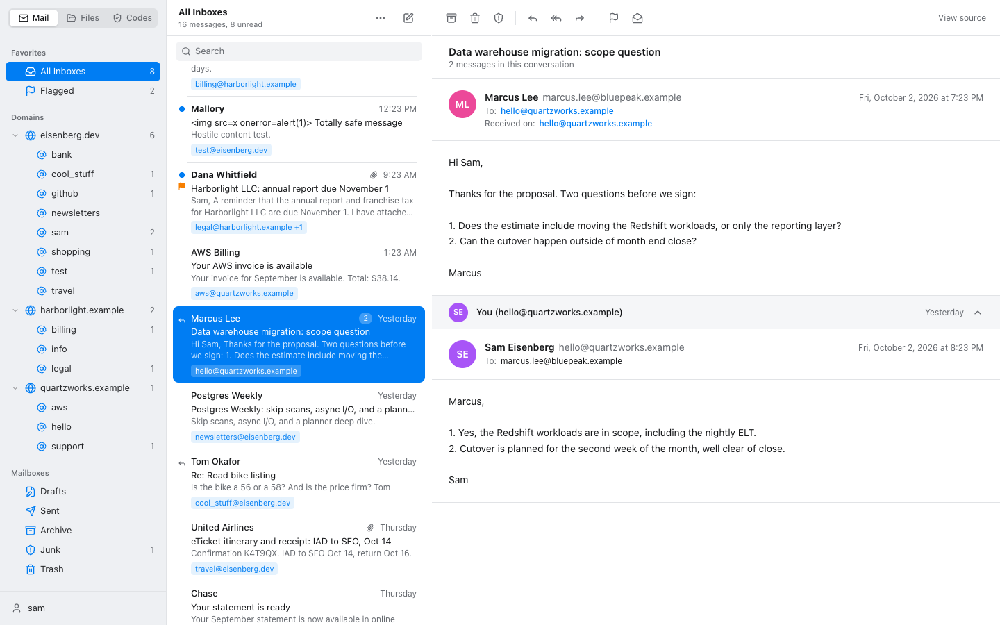

| | |
| --- | --- |
|  | 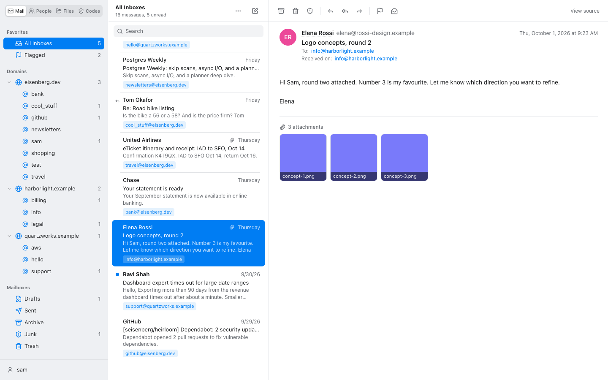 |

### Hostile mail stays harmless, and opening mail stays private

Every byte of an inbound message belongs to the sender. HTML bodies are sanitised, rendered in a
sandboxed frame that cannot run script, and cut off from the network by a Content-Security-Policy
of their own.

Remote images are how senders learn that a message was opened, when, and from where. They are
never loaded by the browser. Each one is replaced by a placeholder of the same size, so the layout
is intact, and a banner offers to show them. When asked, the **server** fetches them: the sender
sees one request from an AWS address with a generic user agent, no cookies and no referrer. The
proxy only fetches addresses that are really in the message, only public hosts, and only serves
what is verifiably a raster image.

| | | |
| --- | --- | --- |
|  |  | 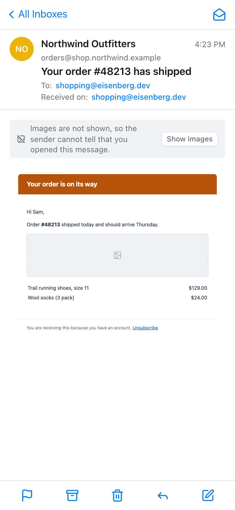 |

### Addresses: forwarding, notifications, notes and blocking

Each receiving address has its own rule: forward a copy to the private mailbox or not, send a push
notification or not, and forward the original inline or as an attachment. A default covers
addresses that have never received mail. Each address can carry a note (who it was given to) and
shows how much mail it holds. **Blocking** an address drops everything sent to it on arrival:
the answer to an alias that has leaked. Mail is always stored and shown in the webmail unless the
address is blocked, so the installed app with notifications can replace forwarding altogether.

An address can also forward to **its own mailboxes** instead of the default one, for example
`billing@` to the bookkeeper, or `team@` to three people. That makes the address a small group:
everyone on the list receives the forward, and any of them can reply from their own mailbox. The
reply goes out from the address itself, and none of their private addresses is shown. A message
sent to several addresses is forwarded separately to each list, so one group never sees another.
Set it from the menu on an address (**Forward to other mailboxes**).

| | |
| --- | --- |
|  | 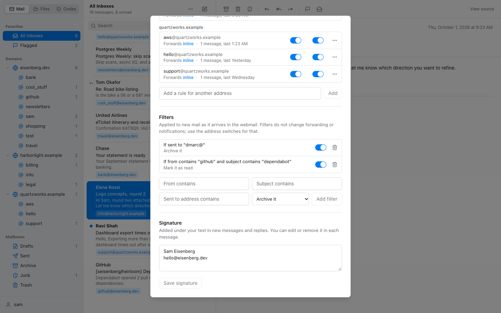 |

The relay works like the one classified-ad sites use:

1. Mail for `cool_stuff@eisenberg.dev` arrives. If that address forwards, the private mailbox
   receives it from `"Jane Park via cool_stuff@eisenberg.dev" <reply-<token>@eisenberg.dev>`.
2. A reply from the private mailbox comes back to the catch-all. It is relayed only if the token
   exists, the sender is the owner, SES reports DMARC `PASS` for it, and it is not an auto-reply.
3. The reply is rebuilt from the body alone. Every header from the owner's mail client is dropped,
   the private address and the relay address are scrubbed from quoted text in every encoding, and
   a final check refuses to send if either still appears anywhere in the message.
4. Jane receives an ordinary reply from `cool_stuff@eisenberg.dev`, correctly threaded.

### On a phone

Below 768px the webmail becomes one screen at a time (Mailboxes, list, message) with the system
back gesture working between them. Swipe a row left to delete and right to toggle read. Wide HTML
mail is scaled to fit. A bar at the bottom switches between Mail, Files, Codes and the account
menu with one tap. The site is an installable web app: unread badge on the icon, push
notifications, 30-day sliding sign-in. The service worker handles notifications only and caches
nothing, so mail never sits in a browser cache.

| | | |
| --- | --- | --- |
|  |  |  |

To install: open `/mail` in Safari (Share, **Add to Home Screen**) or Chrome (**Install**), open
it from the home screen, then account menu, **Mail settings**, **Turn on notifications**. On iPhone, notifications only work from the installed app (iOS 16.4 or later).

### File drop

Upload, download and delete files in S3 from the browser. Everything is private. Switching on
"Public link" moves the file to a separate location and gives it a `/public/<name>` address.
Neither bucket is publicly readable; downloads are short-lived signed links. On a phone the
**Photo** button opens the camera and stores the picture straight away.


### Codes: a built-in authenticator

A small authenticator for the six digit codes other sites ask for. Add an account by taking a
picture of the QR code the site shows (on a phone the camera opens directly), by choosing a
screenshot, by pasting the setup link, or by typing the key. A Google Authenticator export QR
brings in many accounts at once. The secrets are encrypted in the database with a key the database
does not have, and they are never sent back to the browser: the server answers with the current
code only.

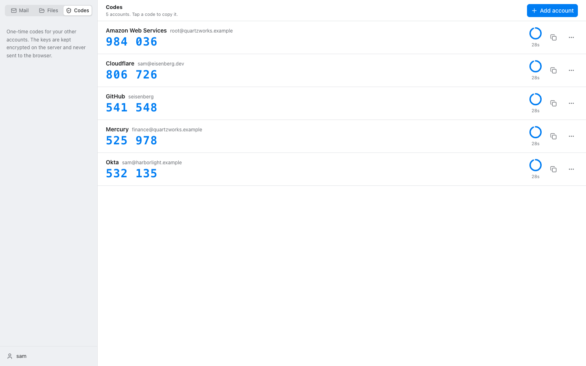

Okta Verify and Microsoft Authenticator do not let accounts be exported. For those, sign in to the
service, add a new "authenticator app" (Google Authenticator) factor, and photograph the QR code it
shows.

| | |
| --- | --- |
| 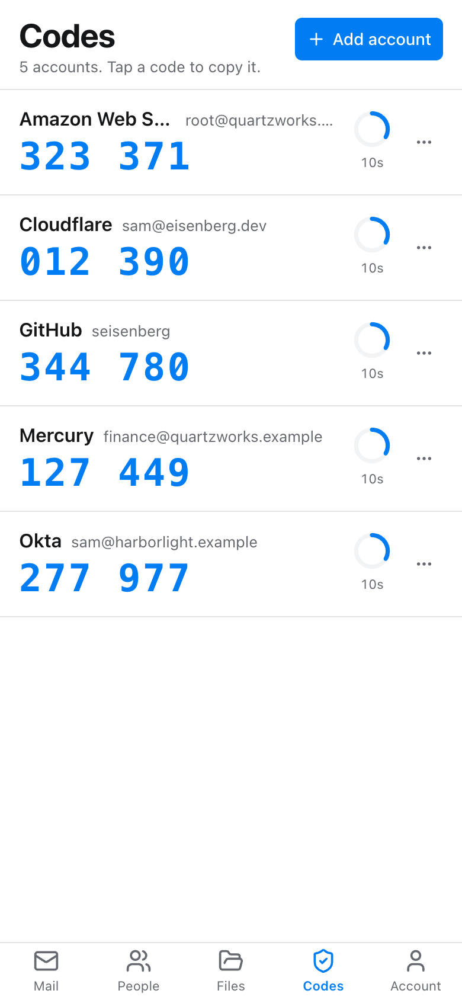 | 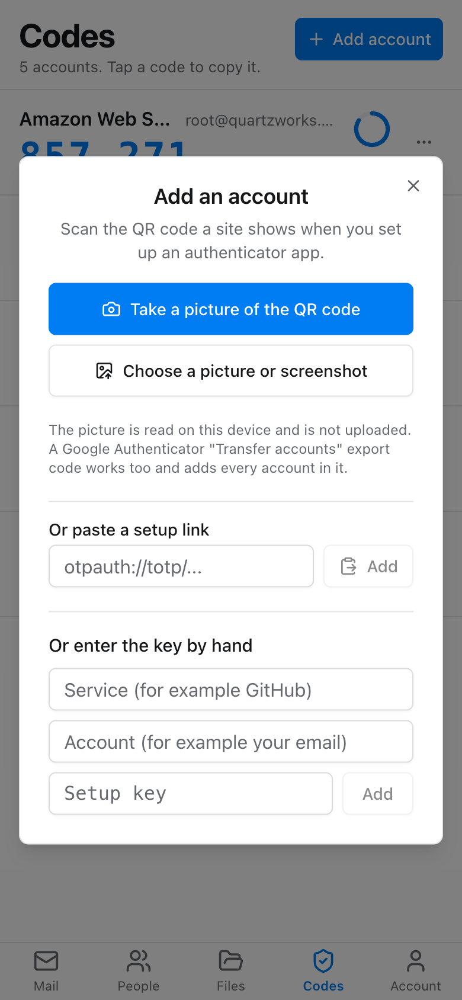 |

### Sign-in and people

Sign-in works the way GitHub's does. A password alone is not enough: a six digit code is sent to a
private mailbox outside the system (or comes from an authenticator app, if you prefer that).
Straight after such a sign-in the site offers to add a **passkey**. From then on that device signs
in with Face ID, Touch ID or its PIN: no password, no code, and nothing a fake site could capture.
The owner can add **members**: separate sign-ins that see only the mail of chosen domains, for
someone who shares one company but should not see the rest.

| | |
| --- | --- |
| 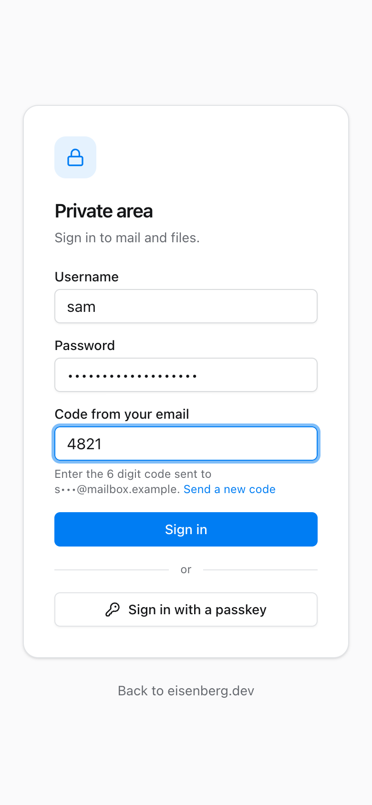 | 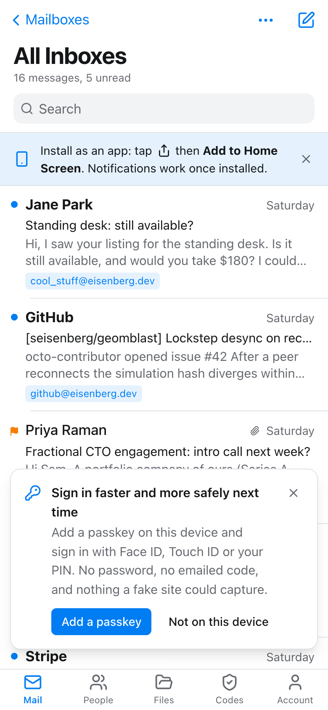 |

| | |
| --- | --- |
| 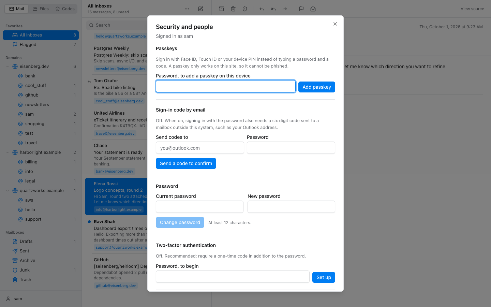 | 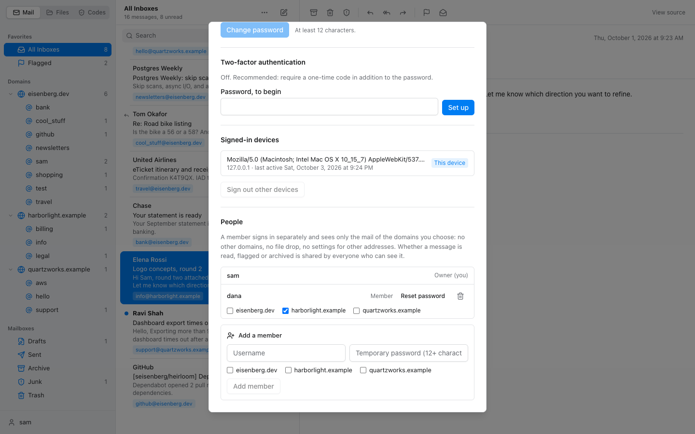 |

### Nothing gets lost

- Every message SES accepts is written to S3 first. A scheduled job compares S3 with the database
  every 15 minutes and replays anything that was never processed, so an outage delays mail instead
  of losing it.
- The database is backed up two ways: daily disk snapshots, and nightly logical dumps in S3 that
  restore into any PostgreSQL. [docs/BACKUP-AND-MIGRATION.md](docs/BACKUP-AND-MIGRATION.md) covers
  restoring, and what it would take to leave AWS.
- Alarms report failing functions, API errors and a deteriorating SES sending reputation by email.

### Dark mode

Follows the system.


## Security

Read [SECURITY.md](SECURITY.md) for the design and the findings of an independent review. In short:

- passkeys, scrypt password hashes, a second step for every password sign-in (emailed code, or
  TOTP with recovery codes), authenticator secrets encrypted at rest, revocable server-side sessions in
  `HttpOnly`, `Secure`, `SameSite=Strict`, `__Host-` cookies, three-layer CSRF defence, login
  throttling that an attacker cannot turn into a lockout;
- every query scoped to what the signed-in user may see;
- strict Content-Security-Policy, no third-party scripts, no CORS;
- parameterised SQL throughout, hostile input cleaned before it reaches the database;
- no secrets in the repository or in container images: they are read from SSM at runtime;
- least-privilege IAM for both functions and for deployment.

Found a problem? See the reporting section of [SECURITY.md](SECURITY.md).

## Run it locally

Needs Node 22 or later. No Docker, no AWS account, no system PostgreSQL.

```bash
npm install
npm run dev
```

Open http://localhost:8080. This starts a throwaway PostgreSQL (the `embedded-postgres` package,
data in `.data/`), applies `db/schema.sql`, seeds mock mail for three domains, logs outgoing mail
instead of sending it, and keeps the file drop on disk. The sign-in for local development is the
`DEV_USER` constant in [scripts/seed.ts](scripts/seed.ts).

```bash
npm test            # API integration tests against a real PostgreSQL
npm run test:e2e    # browser tests (desktop and phone) against the production build; needs Chrome
npm run typecheck
npm run build       # dist/ (UI) and build/ (server)
cd py && uv venv .venv && uv pip install -r requirements-dev.txt && .venv/bin/python -m pytest -q
```

## Deploying

[docs/SETUP.md](docs/SETUP.md) lists every step for a new AWS account: repository settings, three
CloudFormation stacks (bootstrap, database, application), secrets, SES and DNS, the custom domain,
and a checklist to confirm it works. After that, merging to `main` deploys. The database schema
migrates itself: the web function applies `db/schema.sql` at start-up when it has changed.

| Workflow | When | What |
| --- | --- | --- |
| [Tests](.github/workflows/test.yml) | pull requests, `main` | typecheck, API tests, browser tests on desktop and phone, Python tests, both image builds, template lint |
| [Deploy](.github/workflows/deploy.yml) | `main` | tests, then build, push, update both functions through OIDC |
| [CodeQL](.github/workflows/codeql.yml) | pull requests, `main`, weekly | static analysis of TypeScript, Python and the workflows |
| [Dependency review](.github/workflows/dependency-review.yml) | pull requests | blocks newly added vulnerable dependencies |
| [Dependabot](.github/dependabot.yml) | weekly | npm, pip, base images, pinned actions |

## Layout

| Path | What |
| --- | --- |
| `py/` | inbox lambda: `inbox.py` (handler), `relay.py` (message rewriting), `reconcile.py` (replay from S3), `push.py`, `db.py`, `config.py`, `tests/` |
| `src/server/` | web lambda: `app.ts` (routes, headers), `auth.ts`, `passkeys.ts`, `users.ts`, `mail.ts`, `ingest.ts`, `send.ts`, `rules.ts`, `settings.ts`, `push.ts`, `files.ts`, `schema.ts`, `db.ts` |
| `src/ui/` | `pages/` (portfolio, sign-in), `mail/`, `files/`, `settings/`, `components/ui/` (shadcn) |
| `src/shared/api.ts` | types shared by server and UI |
| `public/` | web app manifest, icons, `sw.js` |
| `db/schema.sql` | the whole schema, idempotent |
| `infra/` | `bootstrap.yml`, `database.yml`, `app.yml` (CloudFormation), `db-host.sh` (also prepares your own hardware) |
| `scripts/` | `dev.ts`, `seed.ts`, `set-user.ts`, `apply-schema.ts`, `push-keys.ts` |
| `test/` | API integration tests, `e2e/` browser tests |

## Data model

`lambda_inbox` is the raw store: one row per message with the verbatim MIME, written by whichever
side handled it (`inbound`, `junk`, `relay_out`, `sent`). The web lambda indexes new rows into
`messages` (sender, subject, our addresses and domains, mailbox, flags) when the webmail is open.
`relay_tokens` maps each forward's reply address to its conversation. `address_rules` and
`mail_settings` hold the per-address switches, notes and blocks. `mail_filters`, `drafts`,
`push_subscriptions`, `webauthn_credentials` and `webmail_users` (owners and members) hold what
their names say. `inbox_log` records every message the inbox function has finished with, which is
what lets the reconcile job tell "never processed" from "deliberately dropped".

## Limits worth knowing

- The relay replies to the original sender only (no reply-all), and does not rewrite a name,
  signature or the metadata inside attached files.
- Read, flag and folder state is shared by everyone who can see a message.
- Drafts do not keep attachments; add them when you send.
- No offline mode: the installed app needs a connection.
- A passkey is tied to the site's address. Add passkeys after the site is on its final domain.
- Showing images still tells the sender that the message was opened and when, just not by whom or
  from where. Images over 4.5 MB are not shown. A message with many images makes one request per
  image, and a new AWS account allows only ten concurrent Lambda executions, so some may fail to
  load until that quota is raised.
